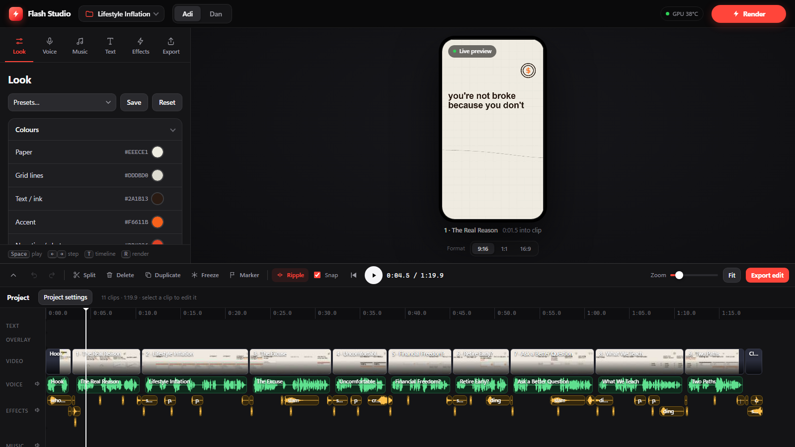
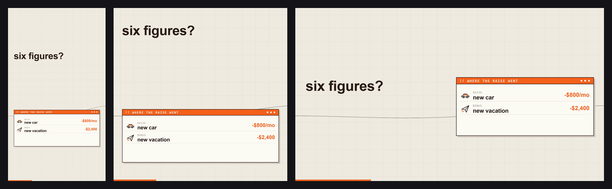

<div align="center">

# Flash Video Director

### Turn a script into a finished explainer video — rendered on your own GPU, polished in a built-in editor.

Flash Video Director draws animated explainer videos from code (no stock footage, no AI video credits), syncs every
scene to a narrated voice, and gives you **Flash Studio**: a local app to shape the look, pick or clone the voice,
add music, sound effects, captions and pictures, and export for **9:16**, **1:1** or **16:9**.


[Quick start](#quick-start) · [Flash Studio](#flash-studio) · [Formats](#one-script-three-formats) · [The editor](#the-editor) · [How it works](#how-it-works) · [Command line](#command-line) · [Docs](#documentation)

</div>



## What you get

- **Two complete visual styles** for the same script. **Adi** lays the story out as a storyboard board and glides a
  camera from frame to frame on the pauses of the narration; **Dan** is a clean, centred card-by-card style.
- **Three formats, really re-laid-out.** Vertical, square and wide are not crops of each other: each one arranges the
  scene for its own shape.
- **Narration that drives everything.** Every beat, camera move and sound cue is timed from the voice. Use a free
  Microsoft neural voice, or **clone a voice** locally with Chatterbox.
- **Fast, cool rendering.** The camera and compositing run on the GPU (OpenGL) and frames stream straight into the
  NVENC encoder, so there are no frame files on disk and the CPU stays quiet. An 80-second vertical video takes about
  3 minutes on an RTX 3050.
- **Flash Studio**, a local web app: projects, live preview, every look setting, voice and music/effects libraries,
  render control, and a **CapCut-style timeline editor** that edits the finished video without re-rendering it.
- **A quality gate.** `qa_check.py` runs 48 automatic checks (size, codec, loudness, beat sync, frame counts,
  layout collisions) on every render.

## One script, three formats



Pick **9:16** (YouTube Shorts, TikTok, Instagram Reels), **1:1** (feed posts) or **16:9** (YouTube, the web) with
one switch under the preview. In 16:9 the headline fills the left half and the card, chart or list sits on the right;
in 1:1 the page is rescaled and each frame is centred. Vertical video is unchanged from the original design.

## Quick start

**You need**

| | |
|---|---|
| OS | Windows 10/11 (built and tested on Windows 11) |
| Python | 3.12 |
| FFmpeg | on your `PATH`, built with `libass` and `libfreetype` (the "essentials" build from gyan.dev works) |
| GPU | an NVIDIA card is recommended (NVENC encoder + OpenGL compositing). Without one, rendering falls back to the CPU automatically, just slower |
| Internet | only the first time a narration voice setting is used (Microsoft's voices are fetched online) |

**Install and run**

```bash
git clone https://github.com/SG78648/flash-video-director.git
cd flash-video-director
pip install -r requirements.txt
python studio.py
```

or double-click **`Flash Studio.bat`**. Your browser opens at <http://127.0.0.1:8765/>. Everything runs on your own
machine, and the server only listens on `127.0.0.1`.

The first launch creates a project called **Lifestyle Inflation** and prepares its narration. Then press **Render**.

> **Cloning a voice (optional).** In the *Voice* tab choose *Clone a voice* and press *Install*. That sets up
> Chatterbox in its own Python 3.11 environment inside the project folder (about 6.5 GB, CUDA PyTorch). Upload a clean
> 10–25 second sample of **one person talking**, and only clone voices you have permission to use. Chatterbox adds an
> inaudible watermark to its audio.

## Flash Studio

| Tab | What it does |
|---|---|
| **Look** | Colours, layout, camera and element switches of the chosen style, with presets and a reset arrow on every setting. The preview updates as you drag. |
| **Voice** | Edge voices or a cloned voice, speaking speed, expressiveness, pacing, a test line, and a one-click *Generate narration*. |
| **Music** | A music library (levelled to −16 LUFS) with a copy per project. Drop a song, listen, drag it onto the timeline. |
| **Text** | Titles and **auto-captions** built from the narration's word timings, with styles (Classic, Box, Pop with the spoken word lit up, Title, Hand) and picture overlays such as a logo. |
| **Effects** | A sound-effect library plus the twelve built-in sounds the renderer itself uses. |
| **Export** | Render quality and cooling, job details, and your finished videos (open the output folder from here). |

The top bar has the **project menu**, the **style** switch (Adi / Dan) and the one big **Render** button, which turns into
the progress bar while it works. Under the preview is the **format** switch. Keyboard: `Space` play, `S` split,
`Del` delete, `Ctrl+Z` undo, `T` hides the timeline.

### Projects keep everything organised

```
projects/<Project name>/   project.json (all settings), adi/ and dan/ (narration, timing, video segments), music/, sfx/, assets/
library/                   cloned voices, presets, the music and effects libraries, shared caches
output/                    finished videos only, one flat folder:  <Project>_<style>_<format>_<date>_<time>[_edit].mp4
```

Switching projects switches the settings, narration, music and timeline together. Working files are never cleared
between renders, and deleting a project never touches the videos in `output/`.

## The editor

The timeline at the bottom is a small video editor for your finished render. It is **non-destructive**: the render is
never changed. Your edit is saved with the project and applied only when you press **Export edit**, which takes
about 15 seconds because nothing is re-rendered.

- **Tracks:** Text, Overlay (pictures), Video, Voice, Effects, Music.
- **Cut, trim and expand.** Split at the playhead, drag a clip's left or right edge to trim it, or drag it outward to
  *restore* what was cut. Dragging a scene's edge brings back its picture **and** its voice and sound effects.
- **Edit scenes like clips.** Ripple delete, reorder scenes by dragging, duplicate, freeze frame, markers, snapping,
  multi-select, 150-step undo/redo.
- **Sound.** Add effects and music from the libraries, set volume, fades, speed, mute and loop-to-fill; music dips under
  the voice; optional loudness normalising to −14 LUFS.
- **Picture.** Per-clip speed and fades, brightness / contrast / saturation, a fade-out at the end, text and captions
  burned in, logo or sticker overlays.
- **Live preview.** Playback schedules every sound in the browser and plays the render clip by clip, so cuts, trims,
  speed and volume are what you hear. The export uses the same edit list.

Details and the full list of shortcuts are in [docs/STUDIO.md](docs/STUDIO.md).

## How it works

```
 script + word timings ──► scenes (Pillow, 2× supersampled) ──► GPU compositor (OpenGL) ──► NVENC ──► video segments
        ▲                                                                                              │
 narration (Edge / Chatterbox)                                                           mux + concat │
        │                                                                                              ▼
        └──► narration stems + sound-effect cues ─────────────────────────────────────────►  render (output/)
                                                                                                       │
                              edit list (cuts, audio clips, text, pictures) ──► one ffmpeg run ──► edited video
```

- **Procedural scenes.** Every scene is drawn in code from the script's beats. Elements appear exactly when the word
  that introduces them is spoken, and a layout audit checks every scene state for overlaps and safe areas.
- **Adi's board.** All frames of the story sit on one long board; the camera only pans along x (with a slight drift that
  follows a thin thread), and only on the pauses between phrases.
- **Voice alignment.** Word times come from the TTS engine, or, for a cloned voice, from forced alignment of the known
  script (so words always match), with a speech-recognition check that regenerates any sentence that does not match.
- **Streaming pipeline.** Frames go from the CPU workers to the GPU compositor to the encoder without touching disk;
  cooling presets (quiet / balanced / fast), low process priority and a GPU temperature guard keep the machine cool.
- **Formats.** The format is chosen once per process (`FLASH_ASPECT`). Adi arranges each scene in named zones
  (headline, visuals, centred beat) mapped to the frame; Dan lays out on a compact virtual page that is scaled to size.

## Command line

Flash Studio is the normal way to work, but everything also runs from the shell:

```bash
python generate_adi.py            # render the Adi style of the active project
python generate_adi.py --audit    # check every frame's layout (no render)
python qa_check.py --video adi    # the 48-check quality gate on the newest render
python remix.py adi               # re-mix narration and effects without re-rendering
```

| Environment variable | Meaning |
|---|---|
| `FLASH_ASPECT` | `9:16` (default), `1:1` or `16:9` |
| `FLASH_PROJECT` | project to work on (default: the one chosen in the app) |
| `FLASH_ENCODER` / `FLASH_RENDER` | `cpu` to force the CPU encoder / compositor |
| `FLASH_CQ` | encoder quality (lower = better and bigger, default 25) |

## Scope, honestly

- **The story is fixed.** The bundled video is *Lifestyle Inflation* (9 clips, about 80 seconds). Flash Studio changes the
  look, layout, voice, sound, text and edit; it does not rewrite the script. A new script needs new scenes and narration.
- **Windows first.** The app uses Windows fonts (Arial, Consolas, Ink Free) and a few Windows-only calls.
- **GPU is optional but worth it.** A wide render takes about 7 minutes on an RTX 3050 (about 3 for vertical).
- **Edits apply to the latest render** of the current project, style and format.
- The older stories (`generate_video.py`, `generate_assets.py`, `generate_hardertoignore.py`) are vertical-only command
  line scripts kept for reference.

## Documentation

| | |
|---|---|
| [docs/STUDIO.md](docs/STUDIO.md) | Flash Studio: every tab, formats, projects and files, voices, the editor and its shortcuts |
| [docs/IMPROVING.md](docs/IMPROVING.md) | The build log: what was tried, what broke, what was measured |
| [docs/PIPELINE.md](docs/PIPELINE.md) | The original command-line pipeline |

## Also in this repo: the Codex prompt skill

`skills/directing-flash-videos` is an installable Codex skill that turns your copy into an approved English narration, a
director's proposal and a production-ready **Gemini Omni Flash** prompt package for stick-figure videos. It is
independent of the app above. Its documentation lives in the localized READMEs:
[简体中文](README.zh-CN.md) · [English](README.en.md) · [日本語](README.ja.md) · [한국어](README.ko.md) · [Português do Brasil](README.pt-BR.md).

## Contributing

Issues and pull requests are welcome. Run `python generate_adi.py --audit` and `python qa_check.py --video adi` before
sending a change to the renderer, and see the build log in [docs/IMPROVING.md](docs/IMPROVING.md) for the conventions
that have grown up around it.

## License

MIT — see [LICENSE](LICENSE).
